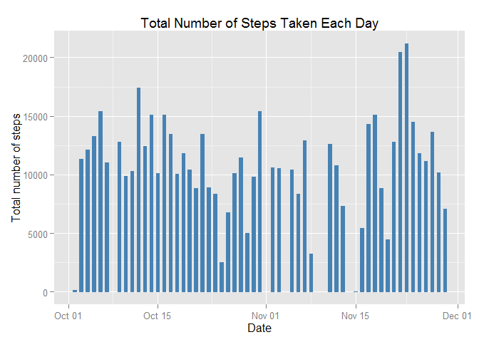
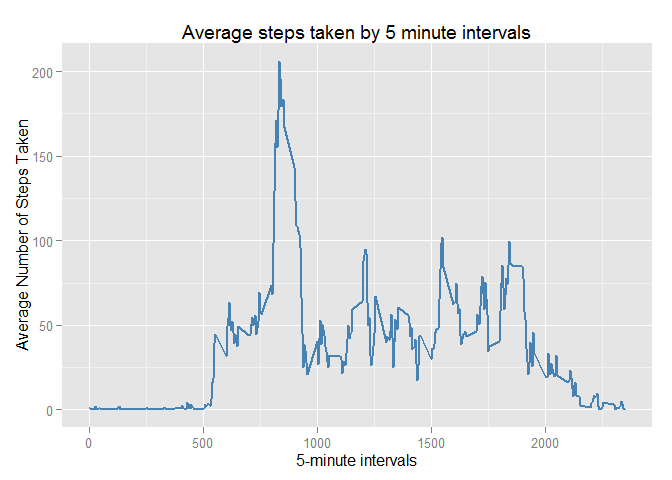
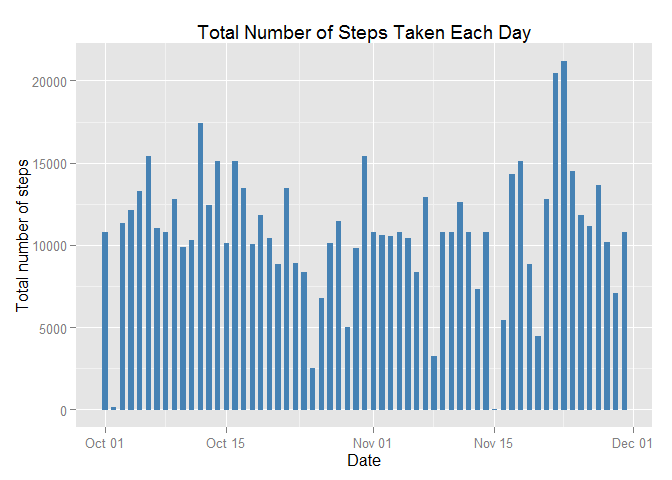
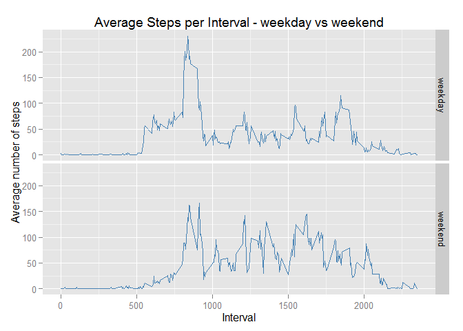

# Reproducible Research: Peer Assessment 1
###Default settings

```r
echo = TRUE  # Always make code visible
library(ggplot2)
```

```
## Warning: package 'ggplot2' was built under R version 3.2.1
```
## Loading and preprocessing the data
###Code required to load and preprocess the data

```r
#Read in the csv data, then create a clean dataset by removing all "NA" values.
unzip("repdata-data-activity.zip")
stepData <- read.csv("activity.csv", colClasses = c("integer", "Date", "integer"))
cleanStepData <- na.omit(stepData)
#Create a dataframe with the steps per day
stepsPerDay <- tapply(cleanStepData$steps, cleanStepData$date, sum)
```
  
  
  
## What is the mean total number of steps taken per day?
###1. Make a histogram of the total number of steps taken each day
Histogram of total number of steps taken each day - missing values are removed

```r
ggplot(cleanStepData, aes(date, steps)) +
  geom_bar(stat = "identity",colour = "steelblue",fill = "steelblue",width =0.5)+
  labs(title = "Total Number of Steps Taken Each Day", x = "Date", y = "Total number of steps")
```

 

###2. Calculate and report the mean and median total number of steps taken per day
Mean

```r
mean(stepsPerDay)
```

```
## [1] 10766.19
```
Median

```r
median(stepsPerDay)
```

```
## [1] 10765
```
  
  
  
## What is the average daily activity pattern?
__1. Make a time series plot (i.e. type = "l") of the 5-minute interval (x-axis) and the average number of steps taken, averaged across all days (y-axis)__

```r
avgStepsPerInterval <- aggregate(x=list(avgSteps=cleanStepData$steps),by=list(interval=cleanStepData$interval), FUN=mean)
ggplot(avgStepsPerInterval,aes(interval,avgSteps))+
  geom_line(color="steelblue",size=1)+
  labs(title="Average steps taken by 5 minute intervals",x = "5-minute intervals", y = "Average Number of Steps Taken")
```

 

__2. Which 5-minute interval, on average across all the days in the dataset, contains the maximum number of steps?__
  
  
The interval is

```r
avgStepsPerInterval[avgStepsPerInterval$avgSteps == max(avgStepsPerInterval$avgSteps),1]
```

```
## [1] 835
```
  
  
  
## Inputing missing values
__1. Calculate and report the total number of missing values in the dataset (i.e. the total number of rows with NAs)__
  
  
Total number of rows missing values: 

```r
sum(is.na(stepData))
```

```
## [1] 2304
```

__2. Devise a strategy for filling in all of the missing values in the dataset.__  
__3. Create a new dataset that is equal to the original dataset but with the missing data filled in.__
  
  
Strategy: For missing values, populate with the mean for that particular 5 minute interval.
i.e. If "2012-10-01 interval 10"" is "na", replace with "interval 10"" average step value.

```r
#Simple imputation by replacing with average step data
paddedStepData<-transform(stepData, steps = ifelse(is.na(stepData$steps),avgStepsPerInterval$avgSteps[match(stepData$interval,avgStepsPerInterval$interval)],stepData$steps))
```
The new dataset:

```r
head(paddedStepData)
```

```
##       steps       date interval
## 1 1.7169811 2012-10-01        0
## 2 0.3396226 2012-10-01        5
## 3 0.1320755 2012-10-01       10
## 4 0.1509434 2012-10-01       15
## 5 0.0754717 2012-10-01       20
## 6 2.0943396 2012-10-01       25
```
  
__4. Make a histogram of the total number of steps taken each day and Calculate and report the mean and median total number of steps taken per day. Do these values differ from the estimates from the first part of the assignment? What is the impact of imputing missing data on the estimates of the total daily number of steps?__  
  
  
Histogram of total number of steps taken each day with padded data

```r
ggplot(paddedStepData, aes(date, steps)) +
  geom_bar(stat = "identity",colour = "steelblue",fill = "steelblue",width =0.5)+
  labs(title = "Total Number of Steps Taken Each Day", x = "Date", y = "Total number of steps")
```

 

New mean and median

```r
newStepsPerDay <- tapply(paddedStepData$steps, paddedStepData$date, sum)
mean(newStepsPerDay)
```

```
## [1] 10766.19
```

```r
median(newStepsPerDay)
```

```
## [1] 10766.19
```
  
__Do these values differ from the estimates from the first part of the assignment?__
  
  
The mean is the same as before, but the median has changed.  
Original mean and median

```r
mean(stepsPerDay)
```

```
## [1] 10766.19
```

```r
mean(newStepsPerDay)
```

```
## [1] 10766.19
```
Imputed mean and median

```r
median(stepsPerDay)
```

```
## [1] 10765
```

```r
median(newStepsPerDay)
```

```
## [1] 10766.19
```
  
  
__What is the impact of imputing missing data on the estimates of the total daily number of steps?__  
It has shifted the median towards the mean.
  
  
  
## Are there differences in activity patterns between weekdays and weekends?
_1. Create a new factor variable in the dataset with two levels -- "weekday" and "weekend" indicating whether a given date is a weekday or weekend day._

```r
# Add a new column indicating if the date is a weekday or weekend
paddedStepData$weekdays <- factor(ifelse(as.POSIXlt(paddedStepData$date)$wday %in% c(0,6),"weekend","weekday"))
levels(paddedStepData$weekdays)
```

```
## [1] "weekday" "weekend"
```

```r
# Get the average steps per interval
avgStepsPerIntervalPadded <- aggregate(x=list(avgSteps=paddedStepData$steps),by=list(interval=paddedStepData$interval,weekdays=paddedStepData$weekdays), FUN=mean)
```
  
_2. Make a panel plot containing a time series plot (i.e. type = "l") of the 5-minute interval (x-axis) and the average number of steps taken, averaged across all weekday days or weekend days (y-axis). The plot should look something like the following, which was created using simulated data._

```r
ggplot(avgStepsPerIntervalPadded, aes(interval, avgSteps)) +
  geom_line(colour = "steelblue")+
  facet_grid(weekdays ~.)+
  labs(title = "Average Steps per Interval - weekday vs weekend", x = "Interval", y = "Average number of steps")
```

 
